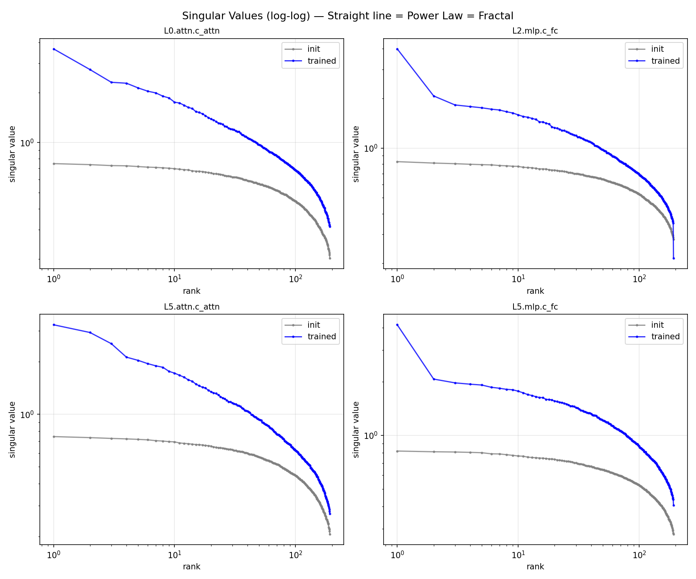
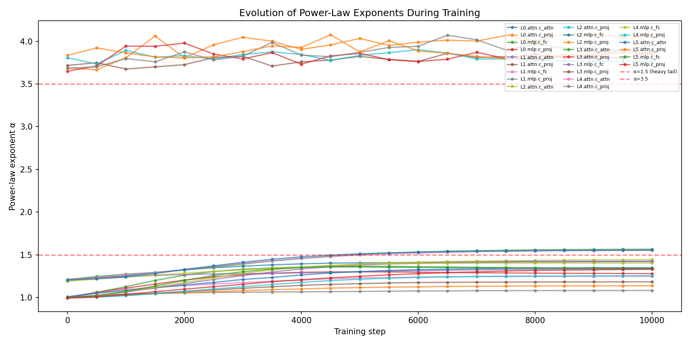
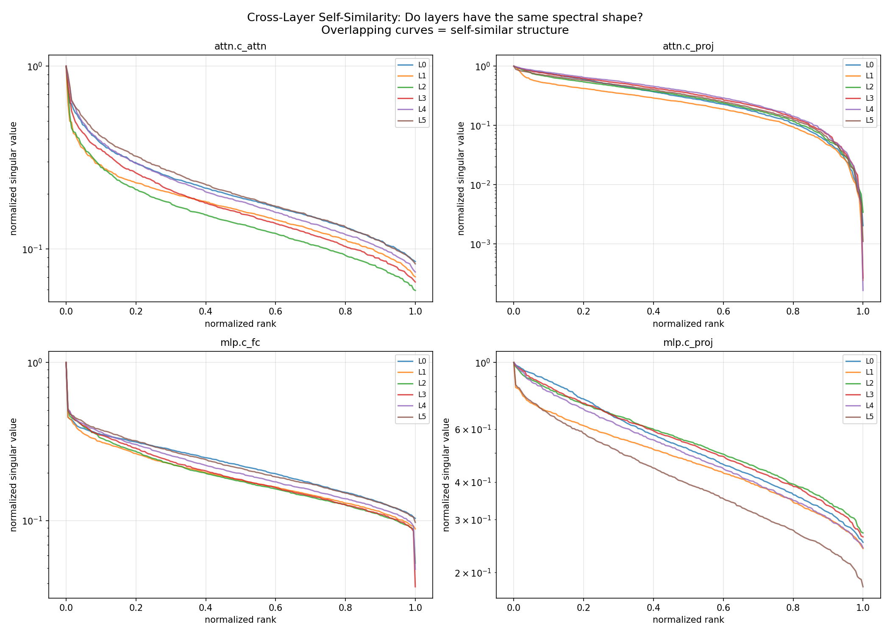
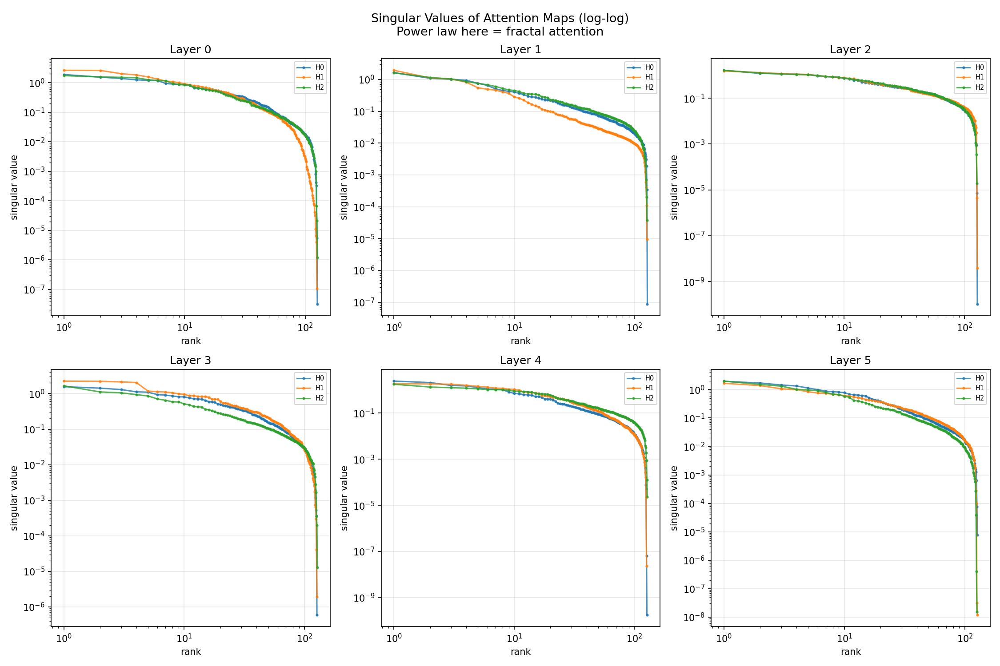
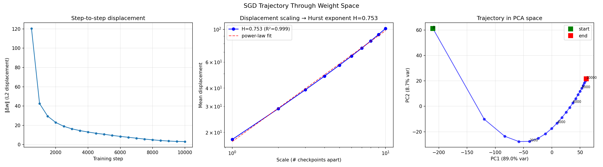
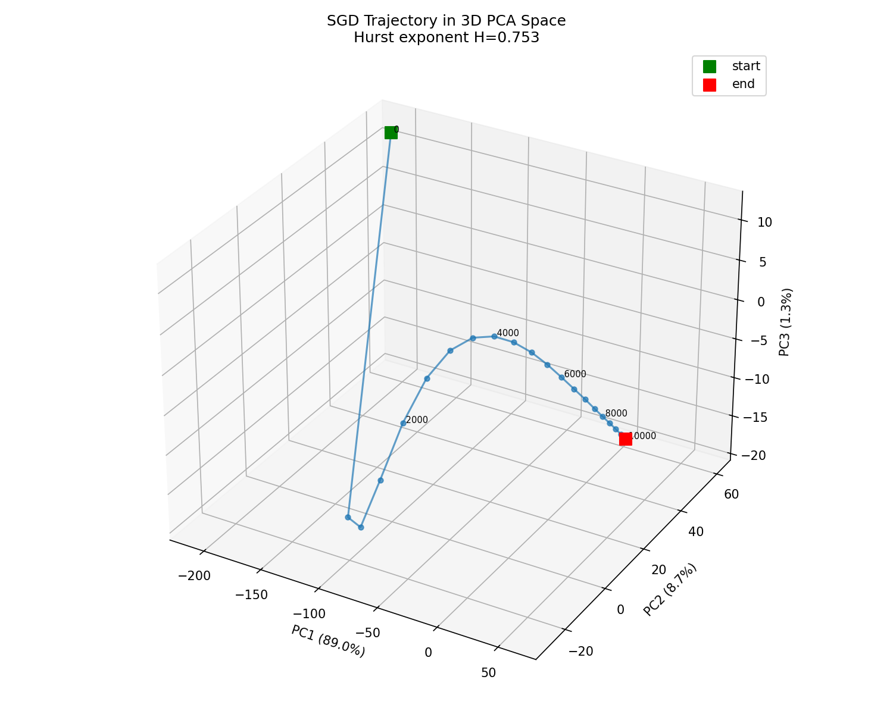
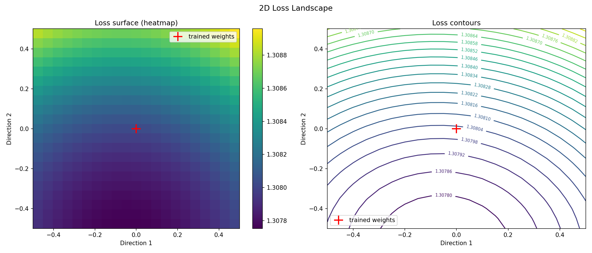

# Fractal Agents

**Autonomous discovery of fractal structure in neural networks.**

We train a small GPT (12.3M parameters) on Tiny Shakespeare and systematically probe its weights, attention patterns, and training dynamics for fractal properties — power-law spectra, self-similarity across layers, and fractal geometry in the optimization trajectory.

The core finding: **neural networks are fractal objects.** Their weight matrices develop heavy-tailed power-law singular value distributions during training, their layers become scaled copies of each other, and the path SGD takes through weight space is itself a fractal curve.

## Key Results

### 1. Power-Law Weight Spectra

Weight matrices develop heavy-tailed singular value distributions that follow power laws, departing from the Marchenko-Pastur distribution expected of random matrices [[1]](#references). Power-law exponents **&alpha; &asymp; 1.1 &ndash; 4.0** (R&sup2; > 0.9), consistent with Martin & Mahoney's heavy-tailed self-regularization theory [[2]](#references).

<p align="center">
  
</p>

Two distinct clusters emerge: attention projection layers (c_proj, &alpha; &asymp; 3.8&ndash;4.0) vs. all others (&alpha; &asymp; 1.1&ndash;1.6). Exponents evolve monotonically during training:

<p align="center">
  
</p>

### 2. Cross-Layer Self-Similarity

Cosine similarity of normalized singular value spectra across all layer pairs exceeds **0.99**. Every layer develops the same spectral shape, just at different scales — the definition of self-similarity [[9]](#references).

<p align="center">
  0.99 cosine similarity"/>
</p>

### 3. Fractal Attention Structure

Attention weight correlation matrices develop **nested block-diagonal structure** — blocks within blocks, the visual signature of hierarchical/fractal organization. This emerges during training from uniform noise at initialization.

<p align="center">
  
</p>

The actual attention patterns themselves follow power-law singular value decay, with remarkably similar curves across heads within each layer:

<p align="center">
  
</p>

### 4. Fractal SGD Trajectory

The path that SGD takes through the 12.3M-dimensional weight space is a fractal curve with **Hurst exponent H = 0.753** (R&sup2; = 0.999) and **fractal dimension D = 1.247**. The trajectory is persistent (H > 0.5), not a random walk — consistent with heavy-tailed gradient noise [[7, 8]](#references).

<p align="center">
  
</p>

<p align="center">
  
</p>

99.1% of the trajectory variance is explained by the top 3 principal components — training lives on a low-dimensional manifold.

### 5. Smooth Loss Landscape (Negative Result)

Loss landscape cross-sections near the trained minimum are **smooth, not fractal** (H &asymp; 1.05). The model sits in a sharp, well-defined parabolic basin. This is consistent with Li et al. [[4]](#references) — loss surface complexity increases with model scale, and our small overfit model hasn't reached that regime.

<p align="center">
  
</p>

## All Results Summary

| Experiment | Method | Finding |
|---|---|---|
| Singular value spectra | Log-log regression | Power-law, &alpha; &asymp; 1.1&ndash;4.0 (R&sup2; > 0.9) |
| Cross-layer similarity | Cosine similarity of spectra | > 0.99 across all layer pairs |
| Attention correlations | Weight correlation matrices | Nested block-diagonal (fractal) structure |
| Box-counting dimension | Binary threshold + box counting | D &asymp; 1.99, attention layers drift down during training |
| Attention map spectra | SVD of attention patterns | Power-law decay, self-similar across heads |
| SGD trajectory | Hurst exponent via displacement scaling | H = 0.753, D = 1.247 (fractal, persistent) |
| Loss landscape | 1D/2D cross-sections + Hurst analysis | Smooth (H &asymp; 1.05), not fractal at this scale |

## Setup

Requires Python 3.12+ and [uv](https://docs.astral.sh/uv/).

```bash
git clone https://github.com/your-username/fractal-agents.git
cd fractal-agents
uv sync
```

## Usage

```bash
# 1. Download and tokenize Tiny Shakespeare
uv run prepare.py

# 2. Train the GPT model (saves checkpoints every 500 steps)
uv run train.py

# 3. Run fractal analyses
uv run analyze.py all            # run everything
uv run analyze.py spectra        # eigenvalue spectra
uv run analyze.py powerlaw       # power-law exponent fitting
uv run analyze.py loglog         # singular value log-log plots
uv run analyze.py zoom           # weight matrix zoom (self-similarity)
uv run analyze.py correlation    # correlation fractal structure
uv run analyze.py filmstrip      # weight evolution filmstrip
uv run analyze.py boxcount       # box-counting fractal dimension
uv run analyze.py attn_corr      # attention weight correlations
uv run analyze.py cross_layer    # cross-layer spectral similarity
uv run analyze.py multifractal   # multifractal spectrum
uv run analyze.py attn_maps      # attention map visualization + spectra
uv run analyze.py sgd_trajectory # SGD trajectory fractal dimension
uv run analyze.py loss_landscape # loss landscape cross-sections
```

Plots are saved to `plots/`. Detailed findings are in [`findings.md`](findings.md).

## Model

| Parameter | Value |
|---|---|
| Architecture | GPT (decoder-only transformer) |
| Parameters | 12.34M |
| Layers | 6 |
| Embedding dim | 192 |
| Attention heads | 6 |
| Context length | 128 |
| Data | Tiny Shakespeare (~304k tokens) |
| Training | 10k steps, AdamW, lr=3e-4 |

## Project Structure

```
fractal-agents/
├── prepare.py          # data download and tokenization
├── train.py            # GPT model definition and training loop
├── analyze.py          # all fractal analysis experiments
├── findings.md         # detailed research findings and observations
├── program.md          # research agenda and progress tracking
├── plots/              # generated visualizations
│   ├── singular_values_loglog.png
│   ├── power_law_evolution.png
│   ├── cross_layer_similarity.png
│   ├── attention_correlations.png
│   ├── sgd_trajectory.png
│   └── ...
└── checkpoints/        # model checkpoints (generated by train.py)
```

## References

<a id="references"></a>

1. **Marchenko & Pastur (1967).** Distribution of Eigenvalues for Some Sets of Random Matrices. *Mathematics of the USSR-Sbornik*, 1(4), 457-483.

2. **Martin & Mahoney (2019).** Implicit Self-Regularization in Deep Neural Networks: Evidence from Random Matrix Theory and Implications for Training. [arXiv:1901.08276](https://arxiv.org/abs/1901.08276)

3. **Martin & Mahoney (2021).** Predicting Trends in the Quality of State-of-the-Art Neural Networks without Access to Training or Testing Data. *Nature Communications*, 12, 4118. [arXiv:2002.06716](https://arxiv.org/abs/2002.06716)

4. **Li et al. (2018).** Visualizing the Loss Landscape of Neural Nets. *NeurIPS 2018*. [arXiv:1712.09913](https://arxiv.org/abs/1712.09913)

5. **Martin, Peng & Mahoney (2021).** Heavy-Tailed Universality Predicts Trends in Test Accuracies for Very Large Pre-Trained Deep Neural Networks. [arXiv:2103.01692](https://arxiv.org/abs/2103.01692)

6. **Pennington & Worah (2017).** Nonlinear Random Matrix Theory for Deep Learning. *NeurIPS 2017*. [arXiv:1710.10121](https://arxiv.org/abs/1710.10121)

7. **Simsekli et al. (2019).** A Tail-Index Analysis of Stochastic Gradient Noise in Deep Neural Networks. *ICML 2019*. [arXiv:1901.06053](https://arxiv.org/abs/1901.06053)

8. **Hodgkinson & Mahoney (2021).** Multiplicative Noise and Heavy Tails in Stochastic Optimization. *ICML 2021*. [arXiv:2006.06293](https://arxiv.org/abs/2006.06293)

9. **Lin, Tegmark & Rolnick (2017).** Why Does Deep and Cheap Learning Work So Well? *Journal of Statistical Physics*, 168, 1223-1247. [arXiv:1608.08225](https://arxiv.org/abs/1608.08225)

10. **Yang & Salman (2019).** A Mean Field Theory of Batch Normalization. *ICLR 2019*. [arXiv:1902.08129](https://arxiv.org/abs/1902.08129)

## License

MIT
